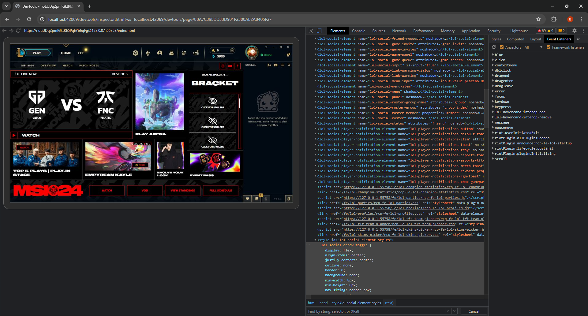
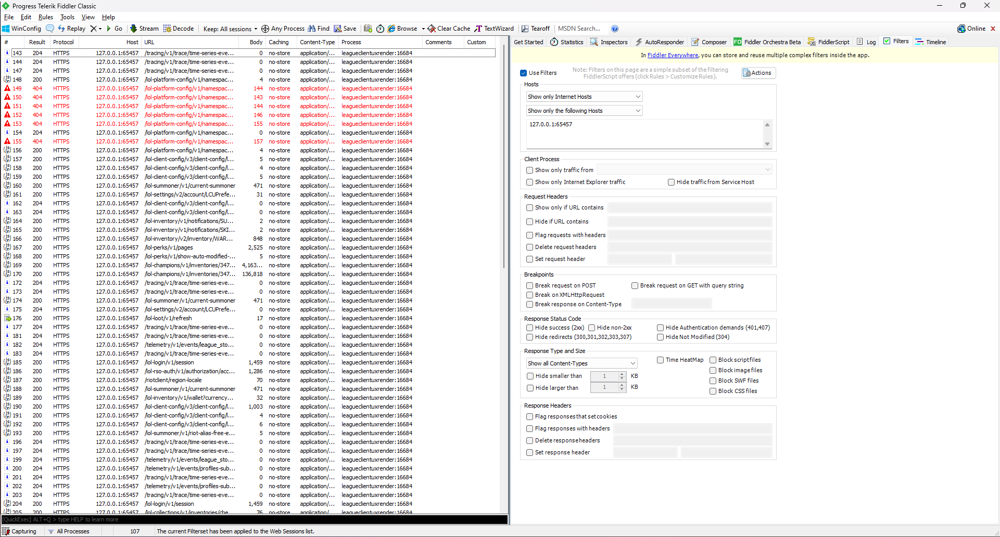
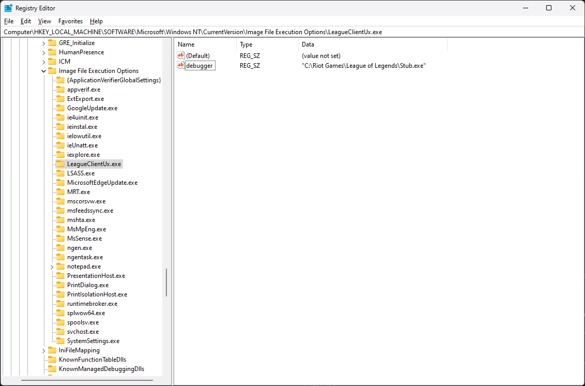

# 🐞 Mecha

> [!NOTE]  
> Mecha has been archived and no longer receives developer support, as it is considered complete.

Mecha is a simple, minimal low-level debugger for the League of Legends client.

**Features:**

- Users can debug the client using the Chrome Developer Tools through remote debugging on a specified port
- Users can enable web debugging proxies, such as Fiddler

  
<b>Click here to see a preview!</b>

  

    
    

# Table of Contents

- [🐞 Mecha](#-mecha)
- [Table of Contents](#table-of-contents)
- [Installation](#installation)
  * [Compilation](#compilation)
  * [Post-Compilation](#post-compilation)
- [Usage](#usage)
  * [Accessing the Developer Tools (Remote Debugging)](#accessing-the-developer-tools-remote-debugging)
  * [Setting up and working with Fiddler](#setting-up-and-working-with-fiddler)
- [FAQ](#faq)
- [Other Projects](#other-projects)
- [License](#license)

# Installation

To install Mecha, you'll need to carefully follow a list of instructions and you'll have to have Administrator rights.

## Compilation

To begin, you'll first have to compile Mecha.

### Prerequisites 

- The Mecha source code (Download from GitHub or get via Git: `git clone https://github.com/x00bence/Mecha.git`)
- Visual Studio 22 or higher
    - **Component:** Desktop development with C++
    - **Component:** Windows SDK
- A few minutes of your time

### Steps

1. Get the Mecha source code
2. Navigate into the Mecha source code directory
3. Navigate into [the **src** subdirectory](./src)
4. Open the [**Mecha.sln** solution file](./src/Mecha.sln) using Visual Studio
5. **Solution Explorer** > right-click **"Solution 'Mecha'"** > **Restore NuGet packages**
6. **Optionally,** [ customize the settings](#customizing-the-settings)
7. Set the configuration to **Release** and the platform to **x64**
8. **Solution Explorer** > right-click **"Solution 'Mecha'"** > **Build Solution**
9. That's it!

Your antivirus may nag you about possible threats after compilation. This is completely normal; Mecha is not doing anything bad. You can fix this by adding an exclusion to the relevant offenders or by disabling your antivirus software.

### Customizing the settings

To customize the settings you'll need to edit a small source file, `Mecha\src\Payload\src\config.h`, before compiling Mecha. The contents of the file are very straightforward. The following defaults are provided:
- `ENABLE_REMOTE_DEBUGGING`: enables remote debugging with the Chrome Developer Tools; default: `true`
- `PORT`: a valid free port for the remote debugger; default: `42069`
- `ENABLE_PROXY_SERVER`: enables web debugging proxies like Fiddler; default: `true`

> [!NOTE]
> Please note that if you wish to change the settings later down the line, you'll have to repeat [compilation steps 2-9](#compilation), as well as
> [post-compilation steps 1-2 (1-8 if working from scratch)](#post-compilation).

## Post-Compilation

Now that Mecha is compiled, the "real" installation process can begin. You'll have to manually move some compiled files then configure the registry.

### Prerequisites

- The compiled `Stub.exe` binary
- The compiled `Payload.dll` dynamic-link library
- Administrator rights on your machine 
- Access to the Registry Editor
- ... and a few more minutes of your time

### Steps

1. Navigate into the compilation output directory (Found at the `Mecha\src\x64\Release` path if you've followed correctly so far)
2. Copy `Stub.exe` and `Payload.dll` into your League of Legends installation directory (For example: `C:\Riot Games\League of Legends`; the directory must contain `LeagueClientUx.exe`)
3. Copy **the path** of the copied `Stub.exe` (Right-click > **Copy as path**)
4. Open the Registry Editor (Windows Key + R, then type `regedit`)
5. Navigate to the `Computer\HKEY_LOCAL_MACHINE\SOFTWARE\Microsoft\Windows NT\CurrentVersion\Image File Execution Options` key
6. Add a new key under `Image File Execution Options` with the name `LeagueClientUx.exe`
7. In the `LeagueClientUx.exe` key, add a new string value named `debugger` with the value data set to the path copied in Step 3
8. Done!

  
<b>Click here to view the intended Registry Editor configuration!</b>

  

    This is what the Registry Editor should look like.
     
    
  

If you've gotten this far, good job! You've essentially just compiled and installed Mecha.

Mecha will persist on every new instance of your client until you decide to get rid of the registry value that was set earlier. 

To get started with debugging, you can read the [usage instructions](#usage).

# Usage

## Accessing the Developer Tools (Remote Debugging)

First, make sure you've compiled Mecha with support for remote debugging (enabled by default). If enabled, the remote debugger will become accessible through the configured port (`42069` by default) once you start the client.

### Steps

To start debugging the client using the Chrome Developer Tools, you'll have to follow these steps:

1. Launch your client
2. In your browser, or using a REST client, visit/GET `127.0.0.1:PORT/json`, where `PORT` is the configured remote debugging port
3. In the resulting JSON, take the value of the `devtoolsFrontendUrl` key in the first object
4. Append the taken value to `127.0.0.1:PORT`; this should result in a URL like `127.0.0.1:PORT/devtools/inspector.html?ws=127.0.0.1:PORT/devtools/page/<ID>`
5. Visit the URL and enjoy debugging!

## Setting up and working with Fiddler

First, make sure you've compiled Mecha with support for enabling proxy servers (enabled by default). If enabled, Fiddler will be able to intercept the HTTP(S) traffic of the client.

> [!NOTE]
> Make sure you only capture traffic **after** the client loads. Otherwise, the client will fail to load and get stuck.

### Prerequisites

- [Fiddler](https://www.telerik.com/download/fiddler)

### Steps

To get Fiddler working with the client, you'll have to follow these steps:

1. In Fiddler, click Tools > Options > HTTPS
2. Click **Decrypt HTTPS Traffic**
3. Click **Ignore server certificate errors**
4. Press `F12` or uncheck **File** > **Capture Traffic** to stop capturing traffic
5. Launch the client and let it load
6. Press `F12` or check **File** > **Capture Traffic** to start capturing traffic
7. Done. Enjoy proxying!

# FAQ

### Q: Can I get banned for using Mecha?

**A:** It's hard to say for certain. Generally speaking, Mecha is >90% safe, as it doesn't really do anything sketchy to misuse or compromise the client out of the box. However, Mecha, just like any other third party tool, falls under the "use at your own risk" umbrella, and as such, Riot Games has every right to take action as required. 

**TL;DR:** Use Mecha at your own risk, as intended, and you'll most likely be fine.

### Q: How does Mecha work?

**A:** **Magic!** (Okay, not really...)

**High-level overview:**
1. In the registry, we set `Stub.exe` as a debugger to `LeagueClientUx.exe`, which will intercept the launch of the client
2. `Stub.exe` spawns `LeagueClientUx.exe` with `Payload.dll` injected
3. `Payload.dll` hooks the `cef_initialize` export of `libcef.dll`, which the client depends on
4. We enable our features by doing extra processing of the command line string through CEF

**Resources to learn more:**

Registry (Image File Execution Options), Debugging:

- [Image File Execution Options](https://learn.microsoft.com/en-us/previous-versions/windows/desktop/xperf/image-file-execution-options)
- [Persistence – Image File Execution Options Injection](https://pentestlab.blog/2020/01/13/persistence-image-file-execution-options-injection/)
- [Creating a Basic Debugger](https://learn.microsoft.com/en-us/windows/win32/debug/creating-a-basic-debugger)
- [How do debuggers bypass Image File Execution Options when launching their debugee?](https://stackoverflow.com/questions/54453249/how-do-debuggers-bypass-image-file-execution-options-when-launching-their-debuge)
- [Injecting DLLs at the start of a Windows process](https://openpunk.com/journal/preinject-dlls/)

Hooking, Reverse Engineering, Hacking:

- [GuidedHacking](https://guidedhacking.com/)

The League of Legends client:

- [THE ARCHITECTURE OF THE LEAGUE CLIENT UPDATE](https://technology.riotgames.com/news/architecture-league-client-update)
- [UNDER THE HOOD OF THE LEAGUE CLIENT’S HEXTECH UI](https://technology.riotgames.com/news/under-hood-league-client%E2%80%99s-hextech-ui)

### Q: Why is installation and configuration so tedious?

**A:** Mecha is designed to be static, simple, and "DIY". Providing support for installation and configuration adds notable difficulty and introduces more points of failure. Additionally, by integrating the settings with the compilation step we can make the resulting files a bit smaller by excluding unneeded features. 

Don't like it? Fork it! :3

### Q: Why is Mecha archived?

**A:** I ([x00bence](https://github.com/x00bence)) have had very dwindling interest in League of Legends in recent times due to the overall stagnating health of the game and the apparent lack of care displayed towards it. Personally, even as a multi-season high elo player, the game feels completely dry and devoid of life and more of a chore to play and interact with than anything. Because of this, I'd like to move on, and unfortunately, that means Mecha has to go, too.

I consider Mecha complete, but in any case, everyone is welcome to fork the project and extend/maintain it.

# Other Projects

The inspiration for Mecha came from these two projects:

- [Ace, Alpha Client Enhancer](https://www.reddit.com/r/leagueoflegends/comments/5dtbv4/introducing_ace_alpha_client_enhancer/)
- [This Hackathon patch diff tool](https://www.reddit.com/r/leagueoflegends/comments/9x0ouh/we_created_a_league_patch_diff_tool_in_the_client/)

If you'd like to do more than just debugging, you can view this other awesome project as well:

- [Pengu Loader](https://pengu.lol/)

# License

[MIT License](./LICENSE)