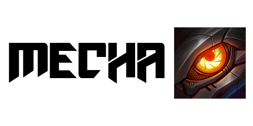

  

  <b>Mecha</b> - debugger and custom plugin loader for the League of Legends client

 

  <h1>Usage</h1>

To use <b>Mecha</b> you must compile it first. <a href="#build">See this for more information.</a>

   

Once compiled, you can open the <b>Mecha GUI</b> via the <code>Mecha GUI.exe</code> file, where you can then manage debug settings and plugins. Other <code>.exe</code> and <code>.dll</code> files are merely dependencies.

   

As the description may already suggest, <b>Mecha</b> allows you to completely debug the client from top to bottom. It also gives you a chance to inject your own JavaScript code and resources into the League of Legends client.

   
   
  <h3 id="features">The Mecha GUI makes this all simple and features functionality for:</h3>

  <ul>
    <li>Hooking and Unhooking your client</li>
    <li>Retrieving the DevTools URL</li>
    <li>Injecting custom JavaScript "plugins" into the client</li>
    <li>Customizing hook settings</li>
  </ul>

   
  
  <h3 id="hook">Installation</h3>
  
  <ol>
    <li><a href="#build">Build</a> or download a compiled version of Mecha</li>
    <li>Launch your LoL client</li>
    <li>Launch <code>Mecha GUI.exe</code></li>
    <li>Press "Hook" (Note: Only once is enough. Your client will be hooked until you unhook.)</li>
    <li>Relaunch your client</li>
  </ol>
  
   

Using <b>Mecha</b> is simple. Clicking around in the GUI should answer all of your questions, but in case something goes wrong, you can always <a href="https://github.com/x00bence/Mecha/issues">create an issue.</a>

   

  <h1>Development</h1>

  <h3 id="build">Building Mecha from Source</h3>

  <ol>
    <li>Clone the repository <code>git clone https://github.com/x00bence/Mecha.git</code></li>
    <li>Build the solution with Visual Studio 2019 using the default <code>Release | x86</code> configuration. (Note: Will <b>NOT</b> compile with other configurations by default)</li>
  </ol>

   

  <h3 id="plugins">JavaScript Plugins</h3>

As noted in above sections, you also have the possibility to develop JavaScript "plugins" that will get executed in the scope of the client. This allows you to directly modify resources, hook and override internal JavaScript, dump data, and more. <b>Mecha</b> tries to be unopinionated and provides no API by default for creating plugins. It's up to the developers to reverse engineer the client, create an API, design the lifecycle flow, and decide the bundling process.

   

Plugins can be installed simply by dragging and dropping them into your chosen "plugins" folder. Plugins are loaded from said folder every time you load or refresh your client. Refer to the <b>Mecha GUI</b> for more information.

   

  <h1>Roadmap in order of priority</h1>

  <ul>
    <li>⚙️ Add support for plugin initialization ordering, exclusions, and more opt-in settings</li>
    <li>🔊 Add error logging, improve fault tolerance</li>
    <li>🔍 Support for resource replacing</li>
    <li>🚀 Minimalist API/Example plugins</li>
    <li>✨ Prettier GUI</li>
  <ul>

   

  <h1>Acknowledgements</h1>

<b>Mecha</b> has been heavily inspired and influenced by <a href="https://www.reddit.com/r/leagueoflegends/comments/5dtbv4/introducing_ace_alpha_client_enhancer/">Ace</a> and <a href="https://www.reddit.com/r/leagueoflegends/comments/9x0ouh/we_created_a_league_patch_diff_tool_in_the_client/">a Hackathon-created patch diff tool</a>.
Although <b>Mecha</b> has different intentions, these two tools ultimately gave the idea to create <b>Mecha</b>. Big shoutouts.

   

  <h1>License</h1>

<b>Mecha is licensed under the MIT license.</b>

   

See the <a href="https://github.com/x00bence/Mecha/blob/master/LICENSE">LICENSE</a> file for more details.

